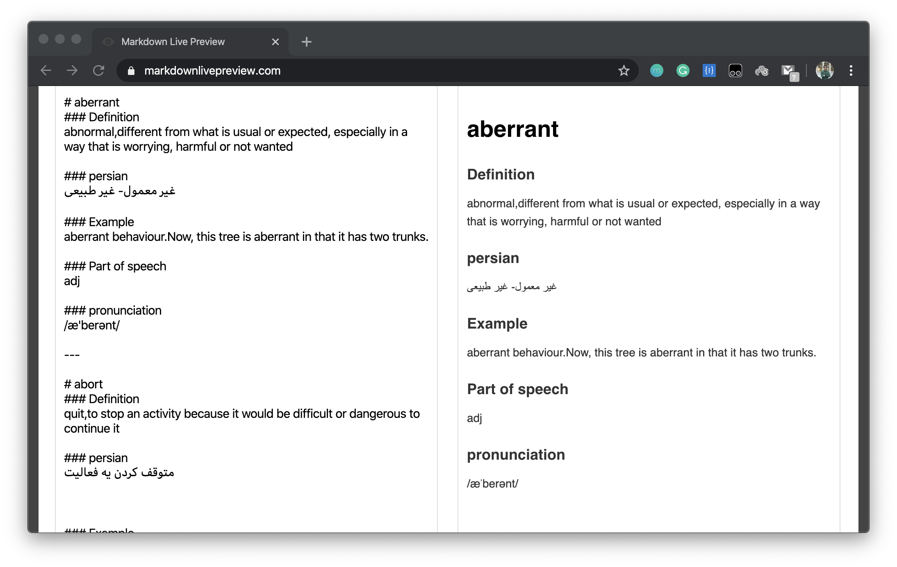
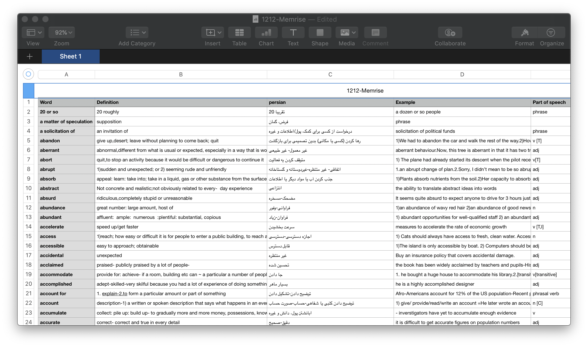

# Memrise Export
This user script exports all of course words with definition and extra info into markdown format or csv format. 

## Installation
The easiest method is through the Tampermonkey [chrome extension](https://chrome.google.com/webstore/detail/tampermonkey/dhdgffkkebhmkfjojejmpbldmpobfkfo) / [firefox addon](https://addons.mozilla.org/en-GB/firefox/addon/tampermonkey/).

Then add the script using the following link: [https://github.com/gsoosk/Memrise-Export/memriseExport.js](https://github.com/gsoosk/Memrise-Export/memriseExport.js)

## How to use?
After installing the script go to home page of the course in memrise website.
Then open `Inspect Elements` of the browser and you can copy the output of script from console.

## Markdown/CSV
To change output format you should change `returnMarkdown` boolean at the start of script.
